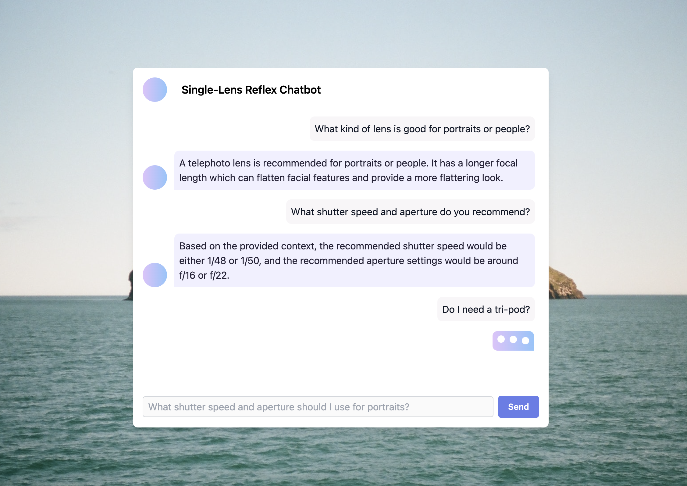

## SLR GenAI Chatbot
SLR is a FReMP stack project. It is a generative AI conversational chatbot that answers questions to do with photography exposure, lenses and colour.

## Motivation
This project was created to experiment with the LLM framework LangChain and OpenAI's API.

## Screenshots


## Tech/framework used

<b>Built with</b>

- ReactJS
- Python
- Flask
- MongoDB
- LangChain

## Installation
### Frontend
The project can be built and hosted locally using Docker containers. You access the app at http://localhost:4200/
```bash
docker-compose up --build
```

To terminate the docker containers.

```bash
docker-compose stop
```

or

```bash
ctrl+c
```

To terminate and remove the docker containers.

```bash
docker-compose down
```


## API Reference
### Backend
The backend uses the [OpenAi API](https://platform.openai.com/) to leverage GPT to talk to the app's data. A LangChain module is used to connect to the API.

### Frontend
The frontend connects to the backend using the localhost:5000
**Endpoints**

- /prompt

## Credits
[Studiobinder](https://www.studiobinder.com/) free e-books:

- Exposure: the Ultimate Guide
- Camera Lenses Explained (Vol. 1)
- How to Use Color in Film (Palettes)
